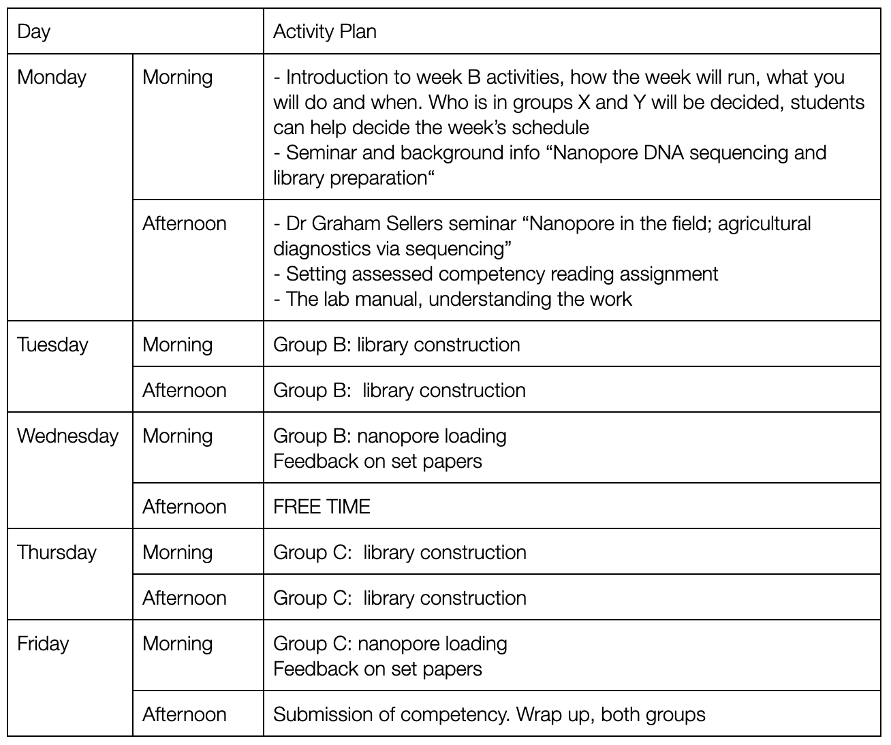

# Week B manual

## Overview of Week B

## Goals of Week B

This week you will

1. Learn the theory of nanopore sequencing and library construction

2. Prepare your DNA extraction for sequencing and create a sequencing library

3. Prepare and load the nanopore

4. Generate DNA data suitable to reconstruct a bacterial genome

## Assessed Portfolio Activities

### Lab Notebook

This week you will continue to complete your lab notebook.This is an
essential part of any scientific research, and without a detailed
experimental record it is poor quality and irreproducible science. Ask
staff for feedback on your lab book, and discuss among yourselves the
best way to keep a useful record.

### Competencies

This week you will have two competencies to document. These are
described in more detail during the introductory session on Monday.

1. Correct calculation of DNA quantities for the sequencing library

2. Brief ("News and Views") summary of a set paper, it\'s science and context

## Learning and Study

We will teach seminars/discussion groups on Nanopore DNA sequencing and
also on sequencing library construction. You will have to read around
this topic.

Dr Graham Sellers will give a seminar describing some of his research
using nanopore DNA sequencing. We will follow with a discussion of the
different ways and different research areas this sequencing technology
can be applied. This ought to feed in very helpfully to your second
competency (to be described in more detail on Monday) where you will
explain the application and significance of applying nanopore sequencing
in different areas by reviewing a paper.

## Lab Work

We will discuss on Monday the best way to arrange this week's work.
Monday will be a theory day, explaining and teaching the essential
background information, with no lab work.

One way to do this is to divide the students in two groups:

Each group would have a heavy lab day preparing a sequencing library,
followed by a lighter lab day, preparing and loading the nanopore.

So group B would work Tues and Weds, Group C would work Thurs and Fri.

The time you are not in the lab would be spent reading the background
material and preparing the paper review competency. We will be available
to support you with this, answer questions, but it is of course your own
work.
