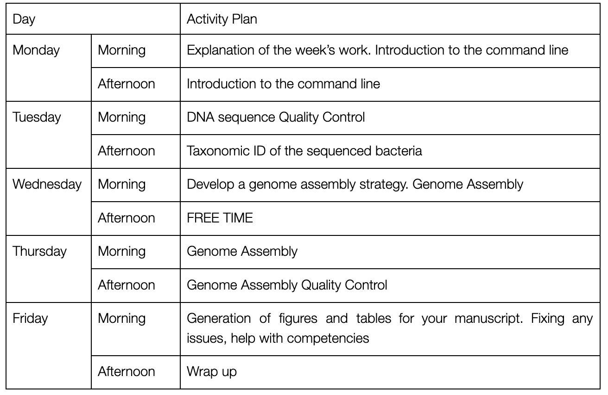

# Week C manual

## Overview of Week C: 30th Jan - 3rd Feb 2023

NB this timetable may be a little fluid to avoid timetable clashes and
to respond to surprisingly slow/quick data analyses.

## Goals of Week C

This week you will

1.  Learn key bioinformatics skills to easily process large amounts of data

2.  Characterise and understand the data from the nanopore sequencer

3.  Quality control the data

4.  Assemble bacterial genomes

5.  Quality control the genomes and describe them suitable for a paper

## Bioinformatics Analyses

Week C is going to be computational. It is important that I stress again
that **I will teach you everything you need to know to analyse your
data. You do not need to know programming, you do not need to be a
computer expert, you only need to get actively involved and work hard.**

This week you will quality control your data, check it, assemble a
bacterial genome and then check and quality control that assembly. This
should produce some key results for your final manuscript, which can be
represented by figures and tables generated this week.

We will be working in a computer lab on campus. You will be using
Jupyter notebooks on one of the University of Hull High-Performance
Computing servers. Many of you will have used these before in Genetic
Analysis of Molecular Evolution modules but if not please let me know
and I will catch you up very easily in 5 mins. I will talk you through
getting set up on Monday morning and make sure everyone is OK. At some
point we may need to break out to use other specialist bioinformatics
computers, but I will talk about this.

## Assessed Portfolio Activities

### Lab Notebook

This week you will continue with your lab notebook. You will keep good
notes, record methods and parameters used. This will be essential
information for writing up your work. You will ask for help and feedback
from academic staff if unsure how to record analyses. Your Jupyter
notebooks for analysis as also an experimental record, like a lab book,
make sure that you keep a copy.

### Competencies

This week you will have two competencies to document. These will be
described in more detail during the week, and in the bioinformatics
notebooks to be provided. You will of course be taught all the skills to
demonstrate these competencies

1.  Demonstrate competency in command line skills by completing
    > competency tasks A, B and C and submitting your Jupyter notebook
    > to Canvas as a PDF.

2.  Produce appropriate tabular and/or graphical descriptions of your
    > sequence and assembly data. You should get this checked, and then
    > submit it as part of your competency portfolio.

NB you must submit a separate PDF to Canvas under the assignment "Week C
unix competency". We will then grade this as part of the competency
assignment using the rubric for that assignment. It\'s really hard to
get this unix work into the same competency document, so this way you
won't have to wrangle it and can just upload a PDF which is much easier.

## Learning and Study

We will teach you bioinformatics with a range of approaches. You will
work through activity notebooks in pairs, with discussion and support
from staff. We will have whole class seminar discussions on aspects of
theory and practice. Lectures, seminar presentations, and journal clubs
will be introduced as time allows in the second half of the week.

## Working with sequence data

We have set up a working environment for you on the University's High
Performance Computer (HPC).

The analyses will use the unix command line as it is the easiest and
time efficient method. This will be combined with other programs in a
Jupyter notebook.

You will need to be very clear about the methods used and keep the
beautiful figures generated by your analyses for later use.

## Questions

Asking good questions means that you can demonstrate a good result

What organism am I sequencing? Are both these isolates E. coli? What
makes a 'good' genome?

## Getting the Data and Notebooks

Monday morning will include a tutorial on downloading the Jupyter
notebooks, data, and everything else that you need. We will make sure
that you are set up.

The command you will need to download the materials is:

`git clone https://github.com/davelunt/BGS.git`

The full genome data is big, and not included in the repository. We will
make sure that you have this available when you need it.

You have mostly been working with small test datasets to build your
analysis skills. These test datasets are \~1% of your sequence data and
the results you get are very valid, but not quite as extensive as they
could be. We have then analysed (using the same exact commands) the
whole dataset and provided the outputs for you. We have uploaded these
files to Canvas. It is perfectly OK for you to treat these "whole
dataset outputs" as the outputs of your own work, they pretty much are.
I think it is OK to just say "our analysis produced report X" and then
show the full dataset report.
