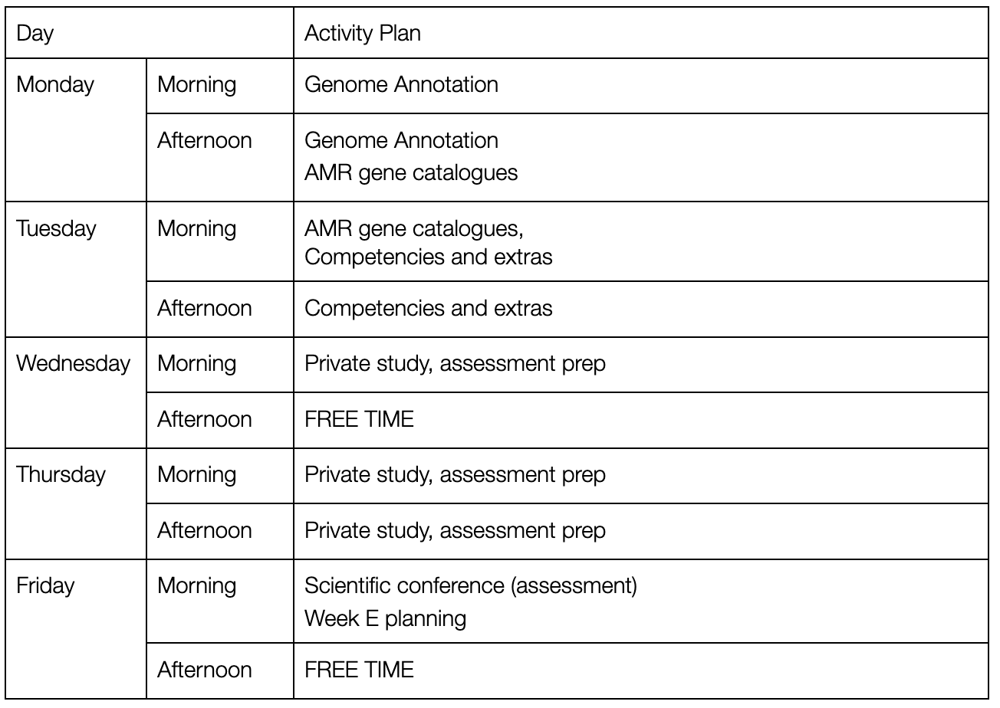

# Overview of Week D

NB this timetable may be a little fluid to avoid timetable clashes and
to respond to surprisingly slow/quick data analyses.

## Goals of Week D

This week you will

1.  Carry out the annotation of your E. coli genomes

2.  Predict antibiotic resistance genes

3.  Present your current work to the class (groups)

4.  Begin to plan week E

## Research

This week I expect you to work even more independently than before.
Although you have instructions and help to achieve what you need this
week gives you the opportunity to make your own investigations.

## Assessed Portfolio Activities

### Lab Notebook

This week you will continue with your lab notebook. You will keep good
notes, record methods and parameters used. This will be essential
information for writing up your work. You will ask for help and feedback
from academic staff if unsure how to record analyses. Your Jupyter
notebooks for analysis as also an experimental record, like a lab book,
make sure that you keep a copy.

### Competencies

This week you will have two competencies to document. These will be
described in more detail during the week, and in the jupyter notebooks
provided.

1.  Demonstrate understanding of genome annotation by explaining how a
    > chosen piece of software goes about it.

2.  Demonstrate knowledge of antibiotic systems by listing antibiotics
    > and their brief mode of action.

## Reading

Extra reading on genome annotation methods, the methods of identifying
AMR genes, and bacterial AMR systems in general will be needed as part
of your week's work. This knowledge will make your assessments much
easier and better

## Scientific Conference (assessment)

Verbal discussion of the format and content will be given during the
week. In brief, presentation groups will talk for 10 minutes, followed
by a few minutes for questions. I expect all students to support their
colleagues by asking scientific questions, and contributing to
discussions. All members of the group should have an individual section
and speak approximately equally.

**Each group member must submit the same PDF presentation to Canvas by
the deadline. NB You must each submit not one person per group.**

I am happy to give feedback on your talks before Friday.
